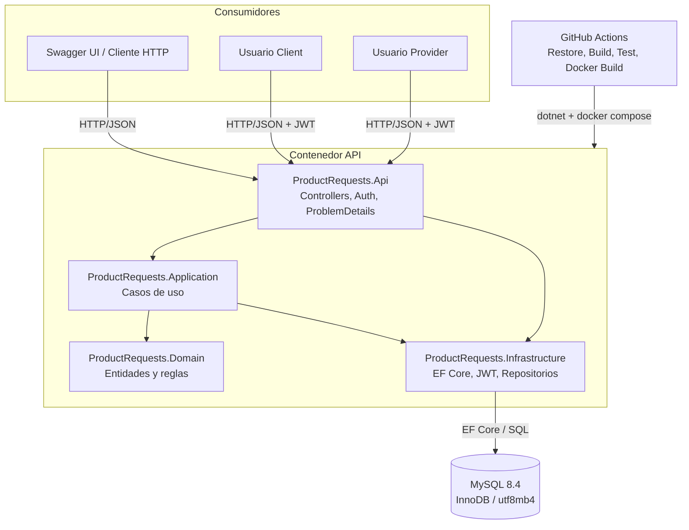

# Diagrama de contenedores

Vista de contenedores lógicos y dependencias principales.

```mermaid
flowchart TB
    subgraph Clientes[Consumidores]
        Swagger[Swagger UI / Cliente HTTP]
        ClientActor[Usuario Client]
        ProviderActor[Usuario Provider]
    end

    subgraph API[Contenedor API]
        ApiApp[ProductRequests.Api\nControllers, Auth, ProblemDetails]
        AppLayer[ProductRequests.Application\nCasos de uso]
        DomainLayer[ProductRequests.Domain\nEntidades y reglas]
        InfraLayer[ProductRequests.Infrastructure\nEF Core, JWT, Repositorios]
    end

    DB[(MySQL 8.4\nInnoDB / utf8mb4)]
    CI[GitHub Actions\nRestore, Build, Test, Docker Build]

    Swagger -->|HTTP/JSON| ApiApp
    ClientActor -->|HTTP/JSON + JWT| ApiApp
    ProviderActor -->|HTTP/JSON + JWT| ApiApp

    ApiApp --> AppLayer
    AppLayer --> DomainLayer
    ApiApp --> InfraLayer
    AppLayer --> InfraLayer
    InfraLayer -->|EF Core / SQL| DB

    CI -->|dotnet + docker compose| API
```
