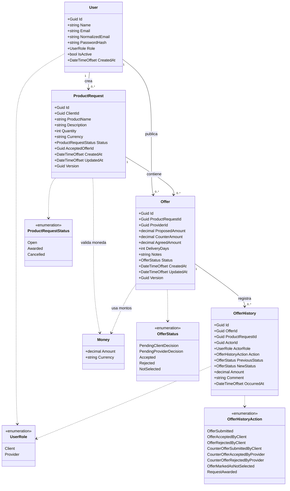

# Diagrama de dominio

Representación de entidades principales del modelo actual.

```mermaid
classDiagram
    class User {
        +Guid Id
        +string Name
        +string Email
        +string NormalizedEmail
        +string PasswordHash
        +UserRole Role
        +bool IsActive
        +DateTimeOffset CreatedAt
    }

    class ProductRequest {
        +Guid Id
        +Guid ClientId
        +string ProductName
        +string Description
        +int Quantity
        +string Currency
        +ProductRequestStatus Status
        +Guid AcceptedOfferId
        +DateTimeOffset CreatedAt
        +DateTimeOffset UpdatedAt
        +Guid Version
    }

    class Offer {
        +Guid Id
        +Guid ProductRequestId
        +Guid ProviderId
        +decimal ProposedAmount
        +decimal CounterAmount
        +decimal AgreedAmount
        +int DeliveryDays
        +string Notes
        +OfferStatus Status
        +DateTimeOffset CreatedAt
        +DateTimeOffset UpdatedAt
        +Guid Version
    }

    class OfferHistory {
        +Guid Id
        +Guid OfferId
        +Guid ProductRequestId
        +Guid ActorId
        +UserRole ActorRole
        +OfferHistoryAction Action
        +OfferStatus PreviousStatus
        +OfferStatus NewStatus
        +decimal Amount
        +string Comment
        +DateTimeOffset OccurredAt
    }

    class Money {
        +decimal Amount
        +string Currency
    }

    class UserRole {
        <<enumeration>>
        Client
        Provider
    }

    class ProductRequestStatus {
        <<enumeration>>
        Open
        Awarded
        Cancelled
    }

    class OfferStatus {
        <<enumeration>>
        PendingClientDecision
        PendingProviderDecision
        Accepted
        Rejected
        NotSelected
    }

    class OfferHistoryAction {
        <<enumeration>>
        OfferSubmitted
        OfferAcceptedByClient
        OfferRejectedByClient
        CounterOfferSubmittedByClient
        CounterOfferAcceptedByProvider
        CounterOfferRejectedByProvider
        OfferMarkedAsNotSelected
        RequestAwarded
    }

    User "1" --> "0..*" ProductRequest : crea
    User "1" --> "0..*" Offer : publica
    ProductRequest "1" --> "0..*" Offer : contiene
    Offer "1" --> "0..*" OfferHistory : registra
    Offer ..> OfferStatus
    ProductRequest ..> ProductRequestStatus
    User ..> UserRole
    OfferHistory ..> OfferHistoryAction
    OfferHistory ..> UserRole
    ProductRequest ..> Money : valida moneda
    Offer ..> Money : usa montos
```
