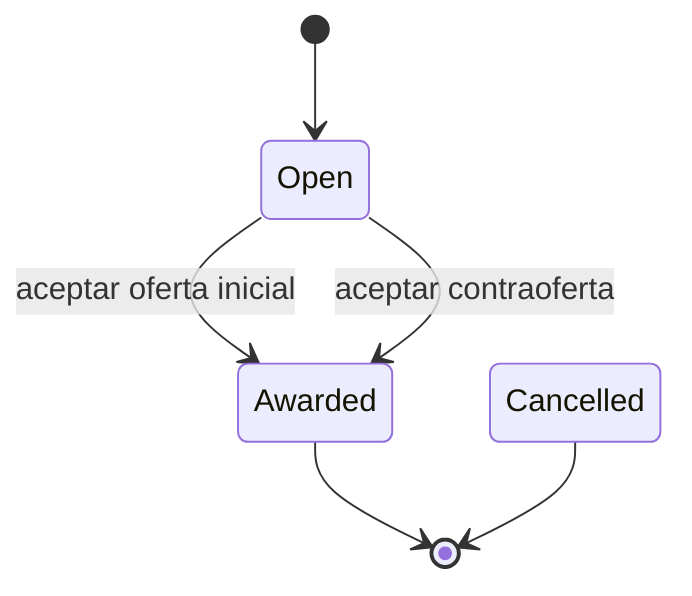
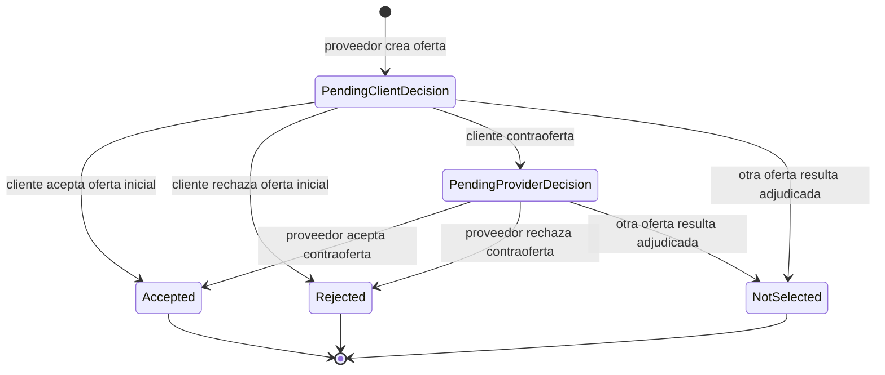

# Diagrama de estados

## Estados de ProductRequest

```mermaid
stateDiagram-v2
    [*] --> Open
    Open --> Awarded: aceptar oferta inicial
    Open --> Awarded: aceptar contraoferta
    Awarded --> [*]
    Cancelled --> [*]
```

`Cancelled` existe en enum, pero no tiene transición implementada en código actual.

## Estados de Offer

```mermaid
stateDiagram-v2
    [*] --> PendingClientDecision: proveedor crea oferta
    PendingClientDecision --> Accepted: cliente acepta oferta inicial
    PendingClientDecision --> Rejected: cliente rechaza oferta inicial
    PendingClientDecision --> PendingProviderDecision: cliente contraoferta
    PendingClientDecision --> NotSelected: otra oferta resulta adjudicada

    PendingProviderDecision --> Accepted: proveedor acepta contraoferta
    PendingProviderDecision --> Rejected: proveedor rechaza contraoferta
    PendingProviderDecision --> NotSelected: otra oferta resulta adjudicada

    Accepted --> [*]
    Rejected --> [*]
    NotSelected --> [*]
```
