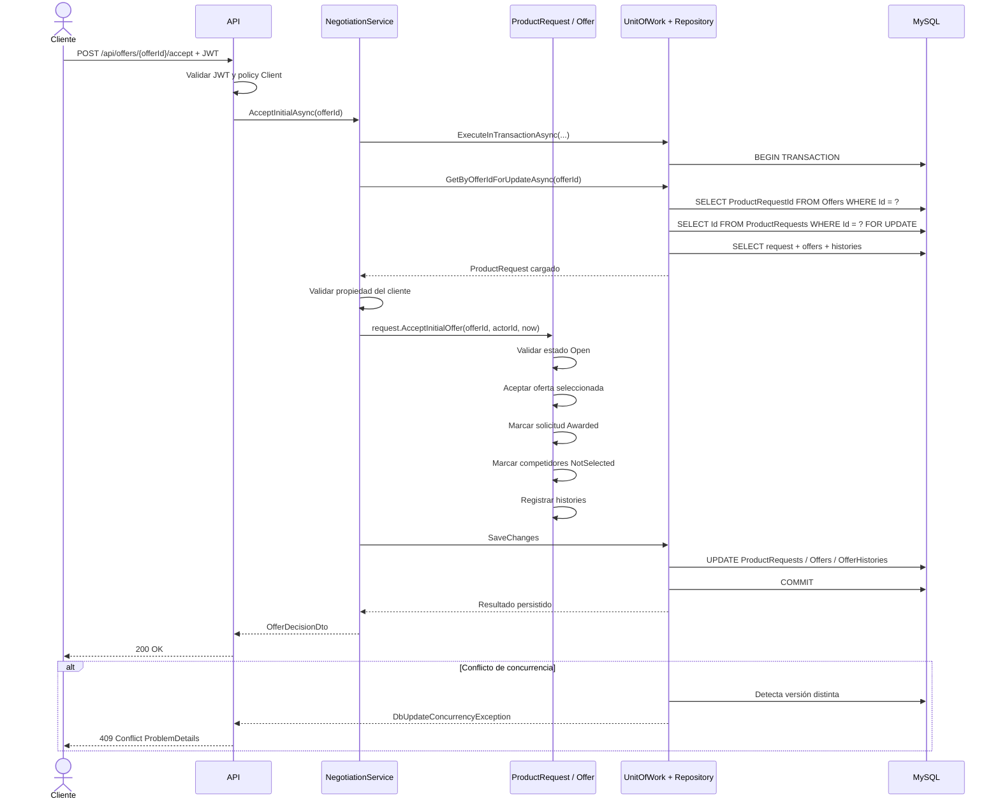

# Diagrama de secuencia: aceptación

Secuencia de aceptación de oferta inicial. Incluye alternativa por conflicto de concurrencia.

```mermaid
sequenceDiagram
    actor Cliente
    participant API as API
    participant App as NegotiationService
    participant Domain as ProductRequest / Offer
    participant Infra as UnitOfWork + Repository
    participant DB as MySQL

    Cliente->>API: POST /api/offers/{offerId}/accept + JWT
    API->>API: Validar JWT y policy Client
    API->>App: AcceptInitialAsync(offerId)
    App->>Infra: ExecuteInTransactionAsync(...)
    Infra->>DB: BEGIN TRANSACTION
    App->>Infra: GetByOfferIdForUpdateAsync(offerId)
    Infra->>DB: SELECT ProductRequestId FROM Offers WHERE Id = ?
    Infra->>DB: SELECT Id FROM ProductRequests WHERE Id = ? FOR UPDATE
    Infra->>DB: SELECT request + offers + histories
    Infra-->>App: ProductRequest cargado
    App->>App: Validar propiedad del cliente
    App->>Domain: request.AcceptInitialOffer(offerId, actorId, now)
    Domain->>Domain: Validar estado Open
    Domain->>Domain: Aceptar oferta seleccionada
    Domain->>Domain: Marcar solicitud Awarded
    Domain->>Domain: Marcar competidores NotSelected
    Domain->>Domain: Registrar histories
    App->>Infra: SaveChanges
    Infra->>DB: UPDATE ProductRequests / Offers / OfferHistories
    Infra->>DB: COMMIT
    Infra-->>App: Resultado persistido
    App-->>API: OfferDecisionDto
    API-->>Cliente: 200 OK

    alt Conflicto de concurrencia
        Infra->>DB: Detecta versión distinta
        Infra-->>API: DbUpdateConcurrencyException
        API-->>Cliente: 409 Conflict ProblemDetails
    end
```
