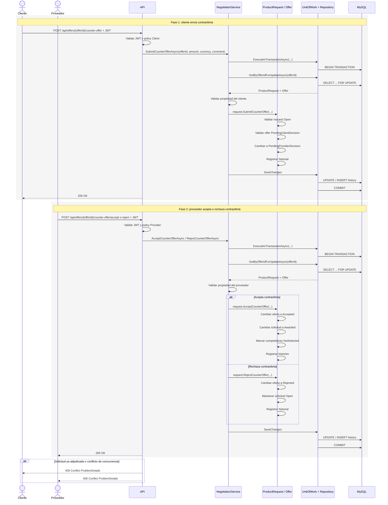

# Diagrama de secuencia: contraoferta

Incluye dos fases: envío de contraoferta por cliente y respuesta del proveedor.

```mermaid
sequenceDiagram
    actor Cliente
    actor Proveedor
    participant API as API
    participant App as NegotiationService
    participant Domain as ProductRequest / Offer
    participant Infra as UnitOfWork + Repository
    participant DB as MySQL

    rect rgb(245,245,245)
    Note over Cliente,DB: Fase 1: cliente envía contraoferta
    Cliente->>API: POST /api/offers/{offerId}/counter-offer + JWT
    API->>API: Validar JWT y policy Client
    API->>App: SubmitCounterOfferAsync(offerId, amount, currency, comment)
    App->>Infra: ExecuteInTransactionAsync(...)
    Infra->>DB: BEGIN TRANSACTION
    App->>Infra: GetByOfferIdForUpdateAsync(offerId)
    Infra->>DB: SELECT ... FOR UPDATE
    Infra-->>App: ProductRequest + Offer
    App->>App: Validar propiedad del cliente
    App->>Domain: request.SubmitCounterOffer(...)
    Domain->>Domain: Validar request Open
    Domain->>Domain: Validar offer PendingClientDecision
    Domain->>Domain: Cambiar a PendingProviderDecision
    Domain->>Domain: Registrar historial
    App->>Infra: SaveChanges
    Infra->>DB: UPDATE / INSERT history
    Infra->>DB: COMMIT
    API-->>Cliente: 200 OK
    end

    rect rgb(245,245,245)
    Note over Proveedor,DB: Fase 2: proveedor acepta o rechaza contraoferta
    Proveedor->>API: POST /api/offers/{offerId}/counter-offer/accept o reject + JWT
    API->>API: Validar JWT y policy Provider
    API->>App: AcceptCounterOfferAsync / RejectCounterOfferAsync
    App->>Infra: ExecuteInTransactionAsync(...)
    Infra->>DB: BEGIN TRANSACTION
    App->>Infra: GetByOfferIdForUpdateAsync(offerId)
    Infra->>DB: SELECT ... FOR UPDATE
    Infra-->>App: ProductRequest + Offer
    App->>App: Validar propiedad del proveedor
    alt Acepta contraoferta
        App->>Domain: request.AcceptCounterOffer(...)
        Domain->>Domain: Cambiar oferta a Accepted
        Domain->>Domain: Cambiar solicitud a Awarded
        Domain->>Domain: Marcar competidores NotSelected
        Domain->>Domain: Registrar histories
    else Rechaza contraoferta
        App->>Domain: request.RejectCounterOffer(...)
        Domain->>Domain: Cambiar oferta a Rejected
        Domain->>Domain: Mantener solicitud Open
        Domain->>Domain: Registrar historial
    end
    App->>Infra: SaveChanges
    Infra->>DB: UPDATE / INSERT history
    Infra->>DB: COMMIT
    API-->>Proveedor: 200 OK
    end

    alt Solicitud ya adjudicada o conflicto de concurrencia
        API-->>Cliente: 409 Conflict ProblemDetails
        API-->>Proveedor: 409 Conflict ProblemDetails
    end
```
